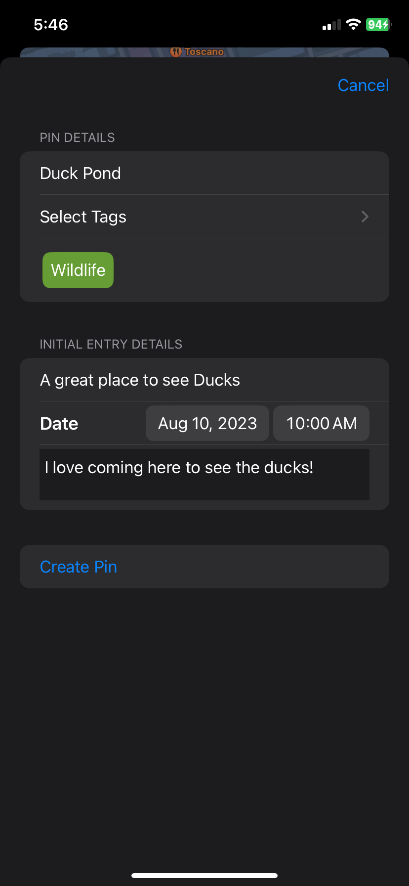

# Geournal

Geournal aims to orient memories and reminders by georgraphic location, rather than time or importance. Users can create pins with multiple descriptions and tags, and see those pins on the map of the world.

### Creating a pin

Holding on the screen brings up a sheet where the user can enter the details of their pin. Each pin gets a title, and an optional tag. The user can enter the details of the first entry for that pin. Each entry gets a title, a time, and a description.

<pre>

           

</pre>

When creating a pin, the user can select tags to later filter the pins by.

<pre>
    

         
    

</pre>

When the user presses "Create Pin" the pin is displayed on the map where they tapped.

<pre>
    

</pre>

### Adding Multiple Pins

The user can then add more pins.

<pre>
    

         
</pre>

### One Pin - Multiple Descriptions

Each pin can have multiple descriptions

<pre>
    

      
</pre>

### One Pin - Multiple Tags

Each pin can have multiple tags

<pre>
    

         
</pre>

### Filtering Pins

The user can filter existing pins using the filter menu.

#### Filtering by Tourism
<pre>
    

      
</pre>

#### Filtering by Wildlife
<pre>
    

           
</pre>

#### Filtering by all pins (default)
<pre>
    

           
</pre>
